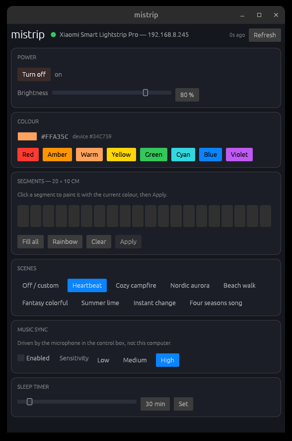

# mistrip

Native Linux control for the **Xiaomi Smart Lightstrip Pro** (`philips.light.strip5`),
written in Rust. No cloud round-trip at runtime, no vendor app, no Windows.

Xiaomi ships no Linux software for this device, and its lighting is reachable only
over the network — the control box is mains-powered and has no USB data interface.
`mistrip` speaks the miIO protocol directly to the device on your LAN.



## Status

Working: protocol layer, CLI, and a native GUI. Two binaries are built —
`mistrip` (CLI) and `mistrip-gui` (desktop app), sharing the library in `src/`.

## How it works

Two documented layers, no reverse engineering required:

**Transport — miIO over UDP 54321.** A 32-byte header (magic `0x2131`, length,
device id, stamp, MD5 checksum) followed by a JSON-RPC payload encrypted with
AES-128-CBC/PKCS#7, where `key = MD5(token)` and `iv = MD5(key || token)`. The
checksum is computed last, over the finished packet with the raw token written
into the checksum field. See [`src/miio.rs`](src/miio.rs).

**Device model — MIoT spec.** Xiaomi publishes this device's full property map at
[home.miot-spec.com/spec/philips.light.strip5](https://home.miot-spec.com/spec/philips.light.strip5):
power, 9 scene modes, brightness, RGB colour, per-segment DIY colours, music sync
with sensitivity, sleep timer, and 21 savable DIY slots. See [`src/strip.rs`](src/strip.rs).

## Setup

You need the device's 32-hex-character **token**, which lives in your Xiaomi
account. Extract it with
[Xiaomi-cloud-tokens-extractor](https://github.com/PiotrMachowski/Xiaomi-cloud-tokens-extractor)
and write the result where `mistrip` looks for it:

```sh
python token_extractor.py -o ~/.config/mistrip/devices.json
chmod 600 ~/.config/mistrip/devices.json
```

If your account has 2FA, use the extractor's QR-code login (`q`) — it avoids the
email-code flow and its 3–5/day rate limit entirely.

> The token is the device's only secret. `mistrip` reads it from that file so it
> never appears in `argv` or your shell history, and `Token`'s `Debug` impl
> redacts it.

## Usage

```sh
mistrip status                      # current state
mistrip on | off | toggle
mistrip brightness 60               # percent, 1-100
mistrip color FF0000                # whole strip
mistrip mode 3                      # built-in scene, 0-8
mistrip rhythm on                   # music sync (control box microphone)
mistrip sensitivity 2               # music sync sensitivity, 0-2
mistrip timer 1800                  # sleep timer in seconds, 0 disables
mistrip segments 0:FF0000 1:00FF00  # individual 10 cm segments
mistrip devices                     # everything in the credentials file
```

## Desktop install

```sh
make install          # both binaries into ~/.cargo/bin
make install-desktop  # icon + menu entry, so the GUI appears in your launcher
```

`make uninstall-desktop` removes the entry and icons again. The GUI does all
device I/O on a worker thread, so an unreachable strip never freezes the
window; it reconnects on its own and polls every 3 s, which means changes made
from the Mi Home app or the physical button show up too.

## Make targets

`make` on its own lists everything. The useful ones:

```sh
make build release install clean    # cargo wrappers
make test fmt clippy check          # check = fmt-check + clippy + test
make token                          # fetch the token into the config file
make config-check                   # verify the file exists and is mode 0600
make status devices probe           # read the device
make color COLOR=00FF00             # ad-hoc control
make brightness LEVEL=40
make mode MODE=5
make segments SEGMENTS="0:FF0000 1:0000FF"
```

Override `CARGO`, `PYTHON` or `EXTRACTOR` as needed, e.g.
`make token EXTRACTOR=/path/to/token_extractor.py`.

## Scene modes

| # | Name | # | Name |
|---|------|---|------|
| 0 | Off / custom | 5 | Fantasy colorful |
| 1 | Heartbeat | 6 | Summer lime |
| 2 | Cozy campfire | 7 | Instant change |
| 3 | Nordic aurora | 8 | Four seasons song |
| 4 | Beach walk | | |

## Notes on the hardware

A 2 m strip has **20 addressable segments** (it changes colour in 10 cm steps);
extensions take it to 5 m / 50 segments. The control box is ESP32-based with a
built-in microphone, which is why music sync needs no PC connection. Firmware
observed during development: `2.1.8_0049`.

The one piece of the spec whose exact grammar is not reliably documented is the
`diy-color` segment string. It is isolated in `strip::format_segments` so it can
be corrected in one place.

## Credits

- [python-miio](https://github.com/rytilahti/python-miio) — reference implementation
- [XiaomiRobotVacuumProtocol](https://github.com/marcelrv/XiaomiRobotVacuumProtocol) — packet format documentation
- [Xiaomi-cloud-tokens-extractor](https://github.com/PiotrMachowski/Xiaomi-cloud-tokens-extractor) — token retrieval

## License

MIT
